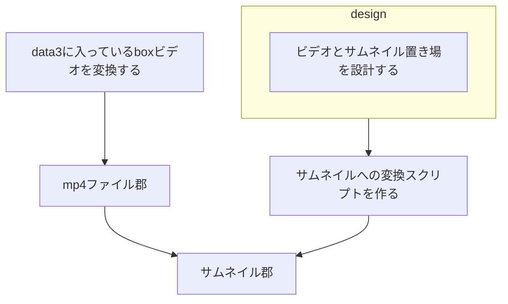

# streaming

## プラン

### ほしい動作
- ビデオのサムネイルがグリッドに並ぶ
- マウスホーバーでgif再生
- クリックするとストリーミングされる

### ver 0.0.1

- ビデオのサムネイルのワイヤーがグリッドに並ぶ

#### サーバーURL設計

- /videos

#### DB設計

- videos
  - id
  - name
  - path

#### サムネ作成

- 並列にすると却って遅い
- 理由は分からないけど
- なので、サムネは、別で作っておく必要あり
- ビデオ本体も、simlinkを張っておかないとだめな気がする

## タスク

